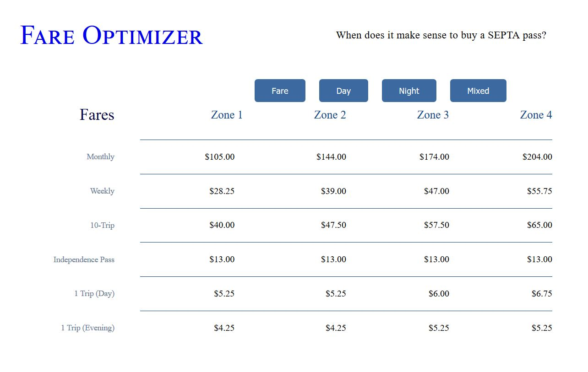

# SEPTA Fare Optimizer
## A one-page utility to identify whether it makes sense to purchase a SEPTA pass.

This project started as a mental exercise - given that I was going to be taking the train a couple of times a week, was it cost effective to just buy a monthly pass?  I originally worked the math out in an Excel spreadsheet, but then thought it would be an interesting exercise to see how far I could get with just HTML and CSS.

This resulting one page app uses CSS styling with minimal javascript to update the visible content of the web page, based on user interactions.

demo: <https://notthedba.github.io/septa-fare-optimizer/>

